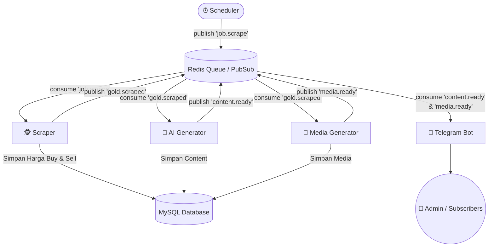

# Arsitektur Proyek: DnarMasID (Gold Price Automation Platform)

## Ringkasan Eksekutif
DnarMasID adalah sebuah platform automasi berbasis *microservices* yang dibuat menggunakan **Go (Golang)** dan **Docker**. Tujuan utama proyek ini adalah mengotomatiskan alur kerja (*pipeline*) pemantauan harga emas Antam harian, pembuatan konten promosi lintas berbagai platform media sosial memanfaatkan **AI (Anthropic API)**, pembuatan visual (gambar/video), dan kemudian mendistribusikannya melalui kanal **Telegram**.

Arsitektur aplikasi terdistribusi namun *loosely-coupled*, yang dihubungkan melalui *message broker* **Redis**. Semua data terstruktur disimpan secara terpusat di **MySQL**.

---

## Arsitektur & Alur Kerja (*Pipeline*)

Proyek ini dibangun menggunakan konsep **Event-Driven Microservices**. Setiap *service* berjalan pada *container* tersendiri dan saling berkomunikasi via Redis *pub/sub* atau *queue*.

### Rincian Servis:
1. **Scheduler** (`services/scheduler`): Berjalan berdasarkan penjadwalan Cron (Default: 08:00 WIB). Satu-satunya tugas servis ini adalah melempar sinyal trigger/job ke Redis.
2. **Scraper** (`services/scraper`): Bertugas membaca (*scraping*) informasi harga dasar (untuk daftar Gramasi Emas Batangan reguler) beserta mengekstrak data dari halaman Harga BuyBack Antam. Data dikalkukasi murni tanpa memasukkan elemen pajak parsial (PPh/Materai), kemudian diteruskan ke servis lain.
3. **AI Generator** (`services/ai-generator`): Memanfaatkan **Anthropic API (Claude)** untuk secara otomatis memproduksi *caption* spesifik bagi 6 platform (Instagram, Facebook, Threads, Twitter, TikTok, YouTube).
4. **Media Generator** (`services/media-generator`): Membuat aset infografis 2D (menggunakan library `gg` di Golang) dan merancang aset video grafis. Data akan ditampung di sistem `volume` supaya siap dibaca bot Telegram.
5. **Telegram Bot** (`services/telegram-bot`): Merangkum hasil teks olahan AI dan grafis visual menjadi satu output bersih, dilesatkan langsung ke panel obrolan di Telegram milik administrator maupun pelanggan yang ter-registrasi.

---

## Tech Stack & Dependencies Utama
- **Bahasa Utama**: Go (versi 1.22)
- **Database Relasional**: MySQL 8.0 (ORM menggunakan `gorm.io/gorm`)
- **Message Broker & Cache**: Redis (7-alpine)
- **Scraping**: `gocolly/colly/v2`
- **Tugas Terjadwal**: `robfig/cron/v3`
- **Render Grafis**: `fogleman/gg`
- **Integrasi Telegram**: `go-telegram-bot-api`
- **Infrastruktur**: Docker Compose

---

## Analisis Model Basis Data (Tabel)

Struktur tabel sangat *domain-driven*:
* `GoldPrice`: Mencatat pergerakan histori fluktuasi Gramasi, Harga Jual Dasar (*Sell Price*/Buyback), Harga Beli Dasar (*Buy Price*). Tabel memiliki indeks identitas tanggal per gramasi guna menekan rekam duplikasi.
* `GeneratedContent`: *Log* dari entitas draf wacana berbasis AI yang dipecah per platform (`PlatformInstagram`, `PlatformTwitter`, dll) berserta status antreannya (*pending* dsb).
* `GeneratedMedia`: Tabel repositori meta dan struktur penempatan media visual per hari/jenis.
* `Subscriber`: Mengelola pelanggan Telegram bot yang berlangganan akses per hari via perintah `/subscribe`.
* `PipelineLog`: Memberikan cara pelacakan/auditori rinci (*logging step-by-step*) berkaitan rentang waktu serta keberhasilan (*sukses/gagal*) fasa `scrape`, `ai_generate`, `media_generate`, `telegram_send`.

---

## Kesimpulan Implementasional
Sistem DnarMasID terancang dengan metodologi **Microservices** yang rapi, solid, dan memprioritaskan ketegasan isolasi kerja. Biaya tinggi (*cost overhead*) layaknya Twitter API berhasil direduksi dengan memusatkan output kontrol administrasi melalui infrastruktur pengirim pesan bot Telegram. Basis kode sudah siap dijalankan untuk beroperasi mandiri setiap jam 8 pagi.
